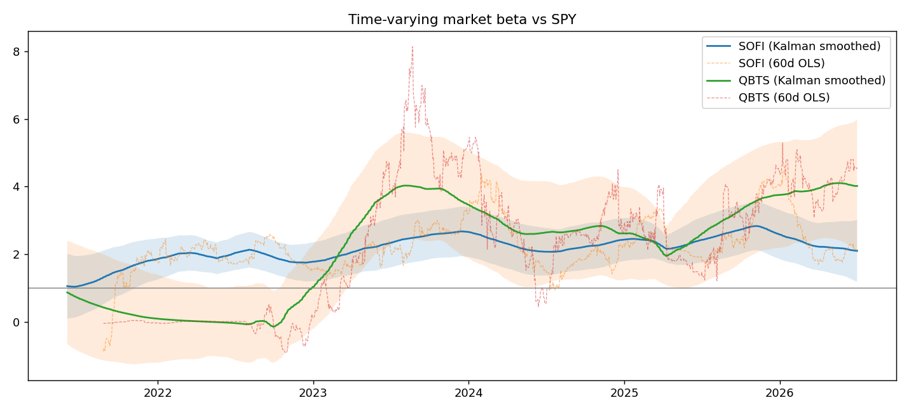

# quant-risk-sleeve

Statistical risk analysis of my own speculative stock sleeve (SoFi + D-Wave Quantum),
built to answer a question my broker app can't: how risky is this thing actually,
and how sure can I be about that number?

I hold a small satellite position in SOFI and QBTS alongside a broad index core.
The usual shortcuts for measuring its risk are wrong in known ways: a single beta
from a five-year regression averages over regime changes, a normal-distribution VaR
ignores fat tails, and a naive bootstrap destroys volatility clustering. This repo
implements the corrected versions of each and reports every risk estimate with a
confidence interval around it.

## Methods

**Time-varying beta (Kalman filter, from scratch).** Market beta is treated as a
hidden state following a random walk and estimated with a Kalman filter plus RTS
smoother. The drift and noise variances are fit by maximum likelihood through the
prediction-error decomposition, which replaces the arbitrary window length of
rolling OLS with a parameter estimated from the data. On synthetic data the
smoother tracks a known beta path with correlation 0.98 and roughly 40% lower RMSE
than a 60-day rolling regression.

**Conditional volatility (GARCH).** GARCH(1,1) fit per asset with Normal and
Student-t innovations compared by AIC. Student-t wins for both names, as expected
for fat-tailed equity returns (fitted tail parameter around 5.5 for SOFI, 4.3
for QBTS).

**Dependent-data inference (stationary block bootstrap).** Politis-Romano
stationary bootstrap for confidence intervals on Sharpe, drawdown, and VaR.
The repo includes a demonstration of why this matters: iid resampling collapses
the observed autocorrelation of squared returns from 0.12 to zero, silently
erasing the volatility clustering that block resampling preserves.

**VaR and Expected Shortfall.** Computed three ways (historical, parametric-t,
GARCH simulation launched from today's conditional variance). The headline
estimate then gets a block-bootstrap confidence interval: resample the return
history, refit the GARCH, recompute the VaR, repeat.

## Results on the live portfolio (2021-2026 sample)

| | SOFI | QBTS |
|---|---|---|
| Smoothed beta, start of sample | 1.05 | 0.87 |
| Smoothed beta, end of sample | 2.10 (±0.92) | 4.02 (±1.98) |
| GARCH persistence (α+β) | 0.981 | 1.000 (degenerate, see below) |
| Annualised unconditional vol | 66% | undefined at persistence = 1 |

Sleeve-level (50/50 weights):

- Annualised Sharpe 0.08, 95% CI [-0.95, 1.04]. The interval straddles zero at
  every block length tested, so the sleeve's risk-adjusted performance is
  statistically indistinguishable from luck. That is the finding, not a failure
  of the method.
- Maximum drawdown 91%, 95% CI [61%, 99%].
- 1-day 95% VaR (GARCH-simulated): 6.5%, with a 90% bootstrap CI of
  [5.3%, 10.3%]. The interval is asymmetric toward worse outcomes, which is the
  direction you want a risk estimate to be honest about. Ten-day VaR is roughly
  22% (ES 29%).

For context, a broad equity index runs a 1-day 95% VaR around 1.5-2%, so the
sleeve carries three to four times market-level daily tail risk. The numbers
quantify why it is sized as a satellite and not a core holding.



## Validation before real data

Every method is first run against synthetic data with planted ground truth
(`scripts/validate_synthetic.py`): a known drifting beta, known GARCH parameters,
known conditional VaR. The Kalman smoother, GARCH MLE, and simulated VaR all
recover the planted values, and the smoothed-beats-filtered-beats-rolling-OLS
ordering comes out exactly as theory predicts. Separating "the code is wrong"
from "the market is surprising" before touching live data was the point.

## The QBTS strain case

QBTS is deliberately kept in the study as a stress test for the methods. It has
about 3.5 years of listed history containing a structural break (a major
acquisition and the 2026 quantum rally), and the GARCH fit responds by pinning
persistence at exactly 1.0, the IGARCH boundary where no stable long-run
volatility exists. Its ending beta of 4 carries a ±2 uncertainty band, and the
smoothed path briefly goes negative, suggesting its returns are driven more by
idiosyncratic news than by the market factor at all. Rather than hiding this,
the writeup treats it as the honest result: some assets strain standard risk
models, and knowing when a model is at its boundary matters more than the point
estimate it produces there.

## Usage

```bash
pip install -r requirements.txt

python scripts/validate_synthetic.py   

pip install yfinance
python scripts/run_analysis.py         # live SOFI/QBTS analysis
```

Portfolio weights, tickers, and the market proxy are set at the top of
`run_analysis.py`. Outputs land in `figures/` and `results_summary.txt`.

## Layout

```
qrs/
  data.py         prices -> log returns -> portfolio series
  kalman.py       Kalman filter, RTS smoother, MLE for the noise variances
  garch_model.py  GARCH fitting, distribution comparison, path simulation
  bootstrap.py    stationary/moving-block bootstrap, CI helpers
  risk.py         VaR/ES three ways, bootstrap CI on the GARCH-VaR
scripts/
  validate_synthetic.py
  run_analysis.py
```

## Limitations

- The VaR confidence interval captures estimation uncertainty only. Model-form
  uncertainty (whether GARCH(1,1)-t is the right model at all) is additional
  and unquantified here.
- QBTS results are indicative rather than precise for the reasons above.
- The sample includes the 2026 quantum rally, a regime that may not repeat;
  all of this is backward-looking risk measurement, not return prediction.
- The Kalman filter's optimality assumes linear-Gaussian dynamics; real returns
  are fat-tailed, so it is a good approximation rather than exact.

## Planned

- Kupiec and Christoffersen backtests on rolling out-of-sample VaR forecasts
- GJR-GARCH to capture the leverage effect
- Residual (model-based) bootstrap as a cross-check on the block bootstrap
- Multi-factor betas (the state-space code already handles vector states)

Built with numpy, scipy, pandas, and Kevin Sheppard's `arch`. The Kalman filter
and bootstrap are implemented from scratch on purpose; the GARCH estimation uses
`arch` because reimplementing a well-tested MLE adds risk without adding insight.
